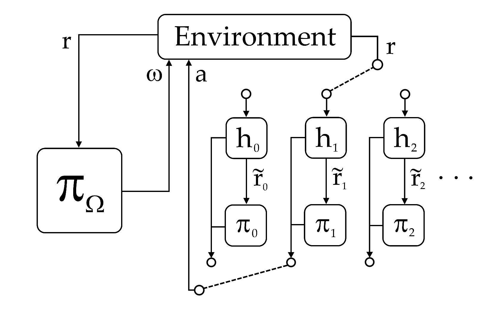

# Attention-Over-Actions Option-Critic (AOAOC)

## Abstract
Option discovery in Reinforcement Learning has become quite popular recently. Since the proposal of Option-Critic, many follow up papers has focused on improving it, many of which ended up with a set of diverse and localized options. In this essay, I will propose a framework for algorithms to produce localized options, then base on the framework, I will derive a new algorithm that categorize sub-task based on the use of actions. This algorithm will be called Attention-Over-Actions Option-Critic because the action vector is Hadamard multiply with an attention mechanism.
## Credit
The code is based on the Option-Critic code from the [ioc repository](https://github.com/kkhetarpal/ioc)
